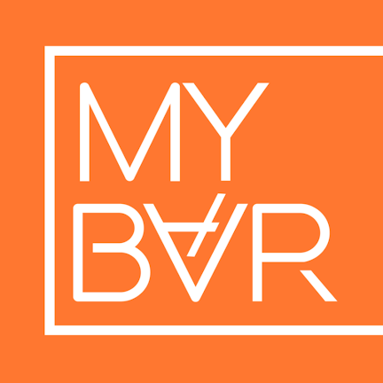
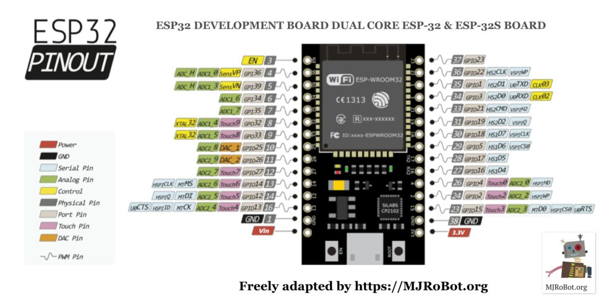

<p align="center"></p>

# MyBar firmware

[](https://github.com/diybar/mybar_firmware/actions/workflows/firmware.yml)
[](https://github.com/diybar/mybar_firmware/releases/latest)

Firmware for the MyBar ESP32 controller board (motor control, glass detection, BLE command interface and over-the-air updates).

## Install the firmware

### From the browser (recommended)

Open **https://diybar.github.io/mybar_firmware/** in Chrome or Edge, connect the board over USB and click *Install*. The page always offers the latest release and needs no Arduino IDE or drivers beyond the USB serial driver of your board.

### Over Bluetooth

Boards already running firmware 1.96 or newer can be updated from the MyBar app without a cable. The protocol and the file to send are described in [docs/FIRMWARE_UPDATE.md](docs/FIRMWARE_UPDATE.md).

### From a release with esptool

Every release on the [releases page](https://github.com/diybar/mybar_firmware/releases) contains:

| File | Use |
|---|---|
| `mybar-<version>.bin` | OTA image, send it through the app |
| `mybar-<version>.merged.bin` | Complete flash image, `esptool.py --chip esp32 write_flash 0x0 mybar-<version>.merged.bin` |
| `mybar-<version>.bootloader.bin`, `.partitions.bin`, `boot_app0.bin` | Individual parts (0x1000, 0x8000, 0xE000; app at 0x10000) |
| `SHA256SUMS`, `MD5SUMS`, `version.json` | Checksums and metadata for the app |
| `mybar-<version>.elf`, `.map` | Debug symbols |

## Releasing a new version

Releases are fully automated by [.github/workflows/firmware.yml](.github/workflows/firmware.yml):

1. Bump `firmwareVersion` in `src/MyBar_*.ino` (for example `"1.97"`).
2. Open a pull request. CI compiles the sketch and attaches the binaries to the workflow run so you can test them.
3. Merge to `main`. CI compiles again and then:
   * creates the git tag `v1.97` and a GitHub release with the binaries and release notes,
   * deploys the web flasher with the new firmware to GitHub Pages.

If `firmwareVersion` was not changed the release step is skipped (the tag already exists) and only the web flasher is redeployed.

One-time repository setup: *Settings → Pages → Build and deployment → Source: GitHub Actions*.

## Building locally

Install [arduino-cli](https://arduino.github.io/arduino-cli/) and the esp32 core (CI uses core 3.3.5):

```
arduino-cli config init
arduino-cli config add board_manager.additional_urls https://espressif.github.io/arduino-esp32/package_esp32_index.json
arduino-cli core update-index
arduino-cli core install esp32:esp32@3.3.5
```

Then build. The script stages the sketch, compiles it for *ESP32 Dev Module* with the *Default 4MB with spiffs* partition scheme and writes all artifacts to `dist/`:

```
scripts/build.sh
```

Libraries in [Libraries/library](Libraries/library) (`Streaming`, `QueueList`, `L9110 Motor driver`) are picked up automatically. `BLE`, `EEPROM` and `Update` ship with the core.

### Arduino IDE

You can still use the Arduino IDE. Copy the libraries from `Libraries/library` into your sketchbook `libraries` folder ([guide](https://www.arduino.cc/en/Guide/Libraries)), add `https://espressif.github.io/arduino-esp32/package_esp32_index.json` to *Additional Board Manager URLs*, install the *esp32* platform and select *ESP32 Dev Module*. Because Arduino needs the folder to carry the sketch name, copy `src/` to a folder called `MyBar_1.96` (matching the `.ino` file) before opening it.

## Repository layout

| Path | Contents |
|---|---|
| `src/` | The sketch: `MyBar_*.ino`, `FirmwareUpdate.h` (BLE OTA), `Task1.h`, `Workload.h` |
| `Libraries/library/` | Third party and in-house Arduino libraries the sketch depends on |
| `scripts/build.sh` | Reproducible build used by CI and locally |
| `web/` | The web flasher page deployed to GitHub Pages |
| `docs/` | [OTA update protocol](docs/FIRMWARE_UPDATE.md) |
| `images/` | Board pinout and SVD file |

## ESP32 board pin out


